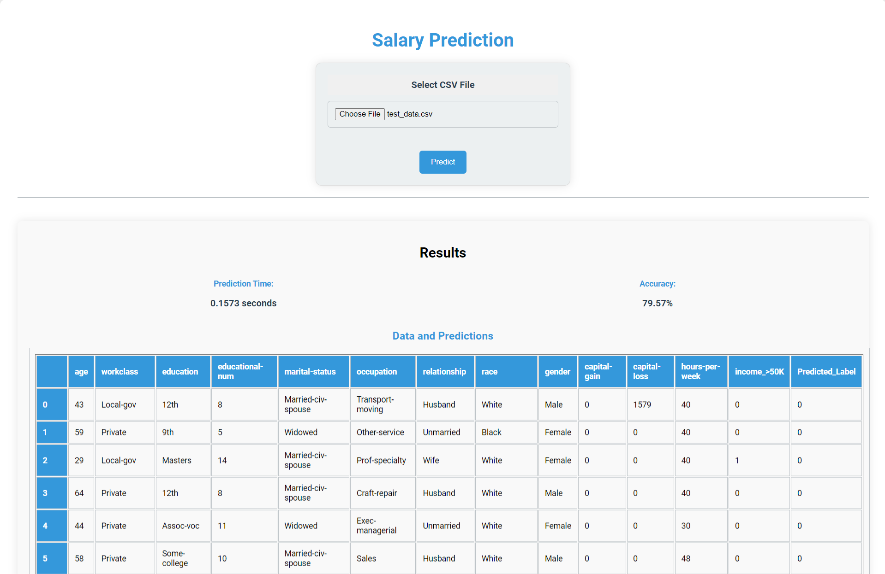

# Prediksi Gaji menggunakan Flask dan TabNet

Proyek ini mengimplementasikan model prediksi gaji menggunakan algoritma machine learning TabNet dan mengaksesnya melalui aplikasi web Flask. Pengguna dapat mengunggah file CSV yang berisi fitur yang relevan, dan sistem akan memprediksi apakah gaji lebih dari $50K.

## Menampilkan Deploy Lokal

Berikut adalah tampilan dari aplikasi yang dijalankan secara lokal:



### Prerequisites

Pastikan Anda telah menginstal prasyarat berikut:

- Python 3.x
- Virtualenv

### Installation

1. Clone the repository:

    ```bash
    git clone https://github.com/mhmmdrafi02/TabNet-ML-Salary-Predictor-Flask.git
    cd TabNet-ML-Salary-Predictor-Flask
    ```

2. Create and activate a virtual environment (optional):

    ```bash
    python -m venv venv
    source venv/bin/activate  # On Windows, use `venv\Scripts\activate`
    ```

3. Install dependencies:

    ```bash
    pip install -r requirements.txt
    ```

4. Run the Flask application:

    ```bash
    python app.py
    ```

## Penggunaan

1. Akses aplikasi web di [http://127.0.0.1:2000/](http://127.0.0.1:2000/).
2. Unggah file CSV dengan dataset.
3. Klik tombol "Predict" untuk mendapatkan prediksi gaji.
4. Lihat hasilnya, termasuk label prediksi, waktu prediksi, akurasi, dan tabel dataset dengan prediksi.

## Struktur Proyek

- [`app.py`](app.py): Berkas aplikasi Flask.
- [`tabnet_model.zip`](tabnet_model.zip): Model TabNet yang telah dilatih.
- [`templates/`](templates/): Templat HTML untuk aplikasi Flask.
- [`image/`](image/): Gambar tampilan deploy.

## Customization

Anda dapat menyesuaikan model dan aplikasi Flask sesuai kebutuhan dengan memodifikasi berkas yang relevan. Selain itu, silakan tingkatkan UI/UX dan styling di folder `templates`.

## Berkontribusi

Jika Anda menemukan masalah atau memiliki perbaikan, jangan ragu untuk membuka isu atau membuat pull request.

## Author

**Muhammad Rafi Maulana**
- GitHub: [@mhmmdrafi02](https://github.com/mhmmdrafi02)
- Email: rafi.maulana.124@gmail.com
